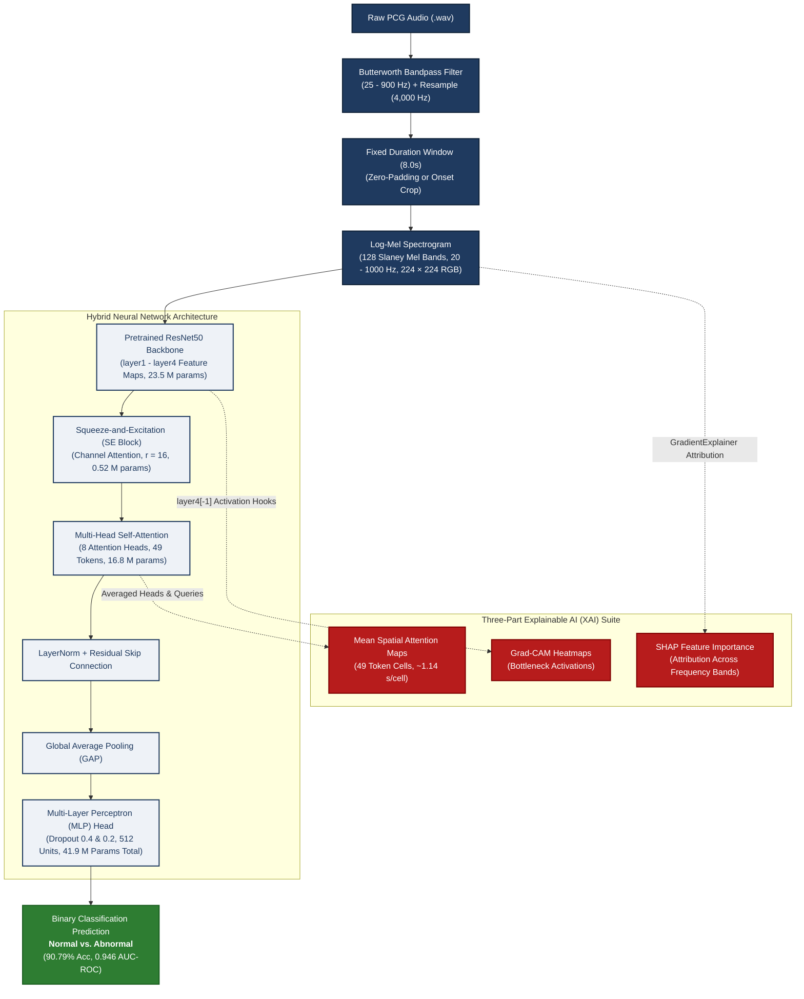

# Explainable AI for Heart Sound Analysis
### Bridging the Gap Between Algorithmic Inference and Clinical Reasoning

[](https://www.python.org/)
[](https://pytorch.org/)
[](https://physionet.org/content/challenge-2016/1.0.0/)
[]()

> **Research Methodology and Seminar (RMS) Project**  
> **Department of Computer Science and Engineering, Nirma University, Ahmedabad**  
> **Authors:** Urva Gandhi (`23BCE078`) & Rakshit Gajnotar (`23BCE077`)  
> **Under the Guidance of:** Dr. Sapan Mankad  

---

## 📌 Executive Summary

Cardiovascular diseases (CVDs) remain the leading cause of global mortality, responsible for approximately 17.9 million deaths annually. While traditional cardiac auscultation using phonocardiograms (PCG) is the primary non-invasive screening technique, it is inherently subjective and heavily constrained by ambient noise and clinician expertise. 

Deep learning models have achieved high diagnostic accuracy in automated cardiac sound classification, yet they function as opaque **"black boxes"**. Clinicians cannot safely rely on automated predictions without clear, physiology-grounded explanations verifying whether decisions are based on genuine pathological murmur signatures rather than recording artifacts or background noise.

This repository implements an end-to-end **Explainable Artificial Intelligence (XAI)** framework for automated heart sound classification on the benchmark **PhysioNet / CinC Challenge 2016** dataset. By integrating a transfer-learned **ResNet50** backbone with **Squeeze-and-Excitation (SE)** channel attention, **Multi-Head Self-Attention (MHSA)** for temporal context, and a three-part interpretability suite (**Grad-CAM**, **mean attention maps**, and **SHAP**), our framework provides actionable, visually intuitive clinical reasoning alongside state-of-the-art diagnostic metrics.

---

## 🔬 Key Contributions & System Architecture



<details>
<summary><b>📐 Click to View ASCII Architecture Diagram</b></summary>

```text
[ Raw PCG Audio (.wav) ]
           │
           ▼
[ Butterworth Bandpass (25 - 900 Hz) + Resample (4,000 Hz) ]
           │
           ▼
[ Fixed Duration (8.0s) (Zero-Padded / Onset-Cropped) ]
           │
           ▼
[ Log-Mel Spectrogram (128 Slaney Bands, 20 - 1000 Hz, 224×224 RGB) ]
           │
           ▼
┌────────────────────────────────────────────────────────┐
│               Hybrid Neural Network                    │
│                                                        │
│  [ Pretrained ResNet50 Backbone (layer1 - layer4) ]    │
│                         │                              │
│                         ▼                              │
│         [ Squeeze-and-Excitation (SE Block) ]          │
│             (Channel Attention, r = 16)                │
│                         │                              │
│                         ▼                              │
│        [ Multi-Head Self-Attention (8 Heads) ]         │
│          (Spatial & Temporal Token Attention)          │
│                         │                              │
│                         ▼                              │
│           [ LayerNorm + Residual Skip ]                │
│                         │                              │
│                         ▼                              │
│         [ Global Average Pooling (GAP) ]               │
│                         │                              │
│                         ▼                              │
│     [ Multi-Layer Perceptron Head (41.9 M params) ]    │
└────────────────────────────────────────────────────────┘
           │
     ┌─────┴─────────────────────────────────────┐
     ▼                                           ▼
[ Prediction ]                             [ XAI Explanations ]
Normal vs. Abnormal                        ├─ Grad-CAM (Bottleneck Activations)
(90.79% Acc, 0.946 AUC)                    ├─ Mean Attention Maps
                                           └─ SHAP Frequency Importance (GradientExplainer)
```

</details>

### 1. Robust Audio Preprocessing Pipeline (Phase 1)
- **Artifact Removal:** 4th-order zero-phase Butterworth bandpass filtering (25 Hz to 900 Hz) suppressing baseline drift below 25 Hz and acoustic hiss above 900 Hz.
- **Sampling Normalization:** Uniform resample to 4,000 Hz.
- **Duration Standardization:** Standardized to 8.0 seconds (32,000 samples) via zero-padding or onset cropping.
- **Time-Frequency Representation:** Extracted Log-Mel Spectrograms with 128 mel bands ($n_{\text{fft}} = 512$, hop length $= 128$) using the default librosa (Slaney) mel scale (20 to 1000 Hz, linear below 1 kHz), normalized and bilinearly resized to $224 \times 224 \times 3$.
- **Data Augmentation:** SpecAugment (frequency masking width 1 to 17 bands, time masking width 1 to 24 frames).

### 2. Hybrid Attention Architecture (Phase 2)
- **Deep Feature Representation:** ImageNet-pretrained ResNet50 extracting 2048-dimensional high-level feature maps (23.5 M parameters).
- **Squeeze-and-Excitation (SE):** Channel-wise dynamic calibration modeling inter-channel relationships (reduction ratio $r = 16$, 0.52 M parameters).
- **Multi-Head Self-Attention (MHSA):** 8 attention heads processing flattened spatial feature tokens ($7 \times 7 = 49$ tokens, key dimension $d_k=256$, 16.8 M parameters).
- **Classifier Head:** Global average pooling, dropout (0.4), 512-unit linear layer with ReLU, dropout (0.2), and 2-unit projection (1.05 M parameters, 41.9 M parameters total).
- **Two-Stage Training Protocol:**
  - *Stage 1 (Warm-up, epochs 1 to 10):* Frozen backbone weights; optimizing SE block, attention layer, and MLP classifier (18.4 M parameters) with AdamW ($\text{lr} = 3\times 10^{-4}$ decaying to $10^{-6}$ via cosine annealing). Backbone BatchNorm layers stay in training mode to adapt running statistics.
  - *Stage 2 (Fine-Tuning, epochs 11 to 40):* All 41.9 M parameters trained with AdamW ($\text{lr} = 3\times 10^{-5}$ decaying to $10^{-7}$) with class-weighted, label-smoothed cross-entropy loss ($\alpha = 0.05$).

### 3. Three-Part Explainability Suite
- **Grad-CAM (Gradient-Weighted Class Activation Mapping):** Visualizes spatial heatmaps from the final bottleneck block (`layer4[-1]`), upsampled bilinearly from $7 \times 7$ grid (~1.14 s per cell).
- **Spatial Attention Maps:** Mean spatial attention maps averaged across heads and queries directly from the single self-attention layer (no recursive attention rollout needed).
- **SHAP (SHapley Additive exPlanations):** GradientExplainer feature attributions approximating Shapley values across mel-frequency bands.

---

## 📊 Experimental Results

Evaluated on the held-out test split of **532 samples** (stratified 70/15/15 train/val/test split across 3,541 PhysioNet 2016 recordings):

| Metric | Score | Clinical Relevance |
| :--- | :---: | :--- |
| **Test Accuracy** | **90.79%** | Correctly classified 483 out of 532 cardiac recordings |
| **AUC-ROC** | **0.9457 (0.946)** | Exceptional discrimination threshold across false positive rates |
| **Balanced Accuracy** | **88.61%** | Robust performance despite inherent dataset class imbalance |
| **Macro F1-Score** | **87.43%** | Balanced harmonic mean of precision and recall |
| **Macro Precision** | **86.42%** | High positive predictive value across classes |
| **Macro Recall** | **88.61%** | High sensitivity minimizing missed cardiac abnormalities |
| **AUC-PR** | **0.8633** | Strong precision-recall trade-off under skewed distributions |

### Comparative Benchmark

| Study | Dataset | Classes | Model | Accuracy (%) | AUC | Explanation |
| :--- | :--- | :---: | :--- | :---: | :---: | :--- |
| Li et al. (2020) | PhysioNet 2016 | 2 | Multi-scale CNN, GAP | 86.80 | N/R | None |
| Ren et al. (2022) | HSS | 3 | CNN, attention pooling | UAR 51.2 | N/R | Frame attention |
| Padhy et al. (2025) | PhysioNet 2016 subset (2,400, balanced) | 5 | CNN and BiLSTM | 99.15 | 0.99 | Saliency |
| Althaph and Challa (2025) | HeartWave; PhysioNet 2016 | 9; 2 | Heart sound transformer | 96.7; 90.3 | N/R | Attention |
| Alrabie and Barnawi (2025) | HeartWave (segmented) | 4 | ResNet50, SE, MHA | 97.3 | N/R | Grad-CAM (mIoU 82%) |
| **This work** | **PhysioNet 2016 (full)** | **2** | **ResNet50, SE, 8-head MHSA** | **90.79** | **0.9457** | **Grad-CAM, attention, SHAP** |

---

## 📁 Repository Structure

```
.
├── Explainable AI for Heart Sound Analysis.docx  # Full Research Paper Manuscript
├── README.md                                     # Project Documentation & Guide
├── requirements.txt                              # Python Dependencies
├── .gitattributes                                # Git LFS configuration (*.pth)
├── .gitignore                                    # Build & cache exclusion rules
│
├── Research Papers/                              # Primary Literature & References
│   ├── Bridging the Gap Between AI and Clinical Reasoning...pdf
│   ├── Classification of Heart Sounds Using CNN.pdf
│   ├── Deep attention-based neural networks for explainable...pdf
│   ├── Development of explainable machine intelligence models...pdf
│   ├── Explainable attention-based deep learning for heart murmurs...pdf
│   ├── What is XAI _.pdf
│   ├── X-CBNet_ An Explainable Effective Deep Learning Framework...pdf
│   └── XAI Framework for Cardiovascular Disease Prediction...pdf
│
├── Review 1/                                     # RMS Review 1: Literature & Scope
│   ├── Literature Review.docx                    # Detailed Literature Synthesis
│   ├── XAI_HeartSound_FINAL.pptx                 # Review 1 Presentation Slides
│   └── XAI_HeartSound_FINAL.odp                  # OpenDocument Presentation
│
├── physionet_2016/                               # Dataset Split Manifests & Weights
│   ├── metadata.csv                              # 3,541 PCG recording entries
│   ├── split_indices.json                        # Stratified train (2478), val (531), test (532)
│   └── class_weights.pt                          # Inverse class frequency tensors
│
├── Review 2/                                     # RMS Review 2: Phase 1 Preprocessing
│   ├── physionet_preprocess.py                   # Data ingestion, filter & spectrogram pipeline
│   ├── Phase1_Data_Preprocessing_Pipeline.ipynb  # Interactive Phase 1 Notebook
│   ├── main.tex                                  # Review 2 LaTeX Beamer Presentation
│   ├── REVIEW_2_PPT.pdf                          # Compiled Review 2 Presentation
│   └── output/                                   # Preprocessing Visualizations
│       ├── augmentation_demo.png
│       ├── class_distribution.png
│       ├── duration_distribution.png
│       ├── envelope_detection.png
│       ├── filter_response.png
│       ├── preprocessing_pipeline.png
│       └── sample_spectrograms.png
│
└── Review 3/                                     # RMS Review 3: Phase 2 Model & XAI
    ├── main.py                                   # End-to-end command-line runner
    ├── model.py                                  # ResNet50 + SE + MultiHeadAttention
    ├── train.py                                  # Two-stage training engine with AMP
    ├── evaluate.py                               # Test set evaluation & metric reporting
    ├── xai.py                                    # Grad-CAM, mean attention maps, and SHAP
    ├── config.py                                 # Hyperparameter and path configurations
    ├── data.py                                   # PyTorch Dataset and DataLoader loaders
    ├── utils.py                                  # Literature comparison & sample picker
    ├── Phase2_Model_Training_XAI.ipynb           # Interactive Model & XAI Notebook
    └── output/                                   # Checkpoints & Analytical Outputs
        ├── checkpoints/
        │   ├── best_model.pth                    # Trained Model Weights (Git LFS)
        │   └── history.json                      # Per-epoch loss and metrics log
        ├── attention_overlays.png
        ├── comparison_table.png
        ├── confusion_matrix.png
        ├── gradcam_overlays.png
        ├── roc_pr_curves.png
        ├── shap_frequency_importance.png
        ├── shap_sample_overlays.png
        ├── test_metrics.json
        ├── test_predictions.csv
        └── training_history.png
```

---

## 🚀 Getting Started

### 1. Prerequisites & Installation

Clone the repository and install required packages:
```bash
git clone https://github.com/urvagandhi/heart-sound-analysis.git
cd heart-sound-analysis

# Initialize Git LFS to pull model weights
git lfs install
git lfs pull

# Create virtual environment and install dependencies
python -m venv venv
# On Windows:
.\venv\Scripts\activate
# On Linux/macOS:
source venv/bin/activate

pip install -r requirements.txt
```

### 2. Running Preprocessing (Phase 1)

Download and generate Log-Mel Spectrograms from PhysioNet 2016:
```bash
python "Review 2/physionet_preprocess.py"
```

### 3. Model Training & Evaluation (Phase 2)

Execute full end-to-end training and evaluation:
```bash
python "Review 3/main.py"
```

Optional CLI flags:
```bash
python "Review 3/main.py" --epochs 30 --warmup 5 --batch 32
python "Review 3/main.py" --skip-train               # Evaluate existing checkpoint
python "Review 3/main.py" --skip-shap                # Skip slow SHAP computation
```

---

## 📑 Citation & Research Paper

```bibtex
@article{gandhi2026xaiheartsound,
  title   = {Explainable AI for Heart Sound Analysis: Bridging the Gap Between Algorithmic Inference and Clinical Reasoning},
  author  = {Urva Gandhi and Rakshit Gajnotar and Dr. Sapan Mankad},
  journal = {Department of Computer Science and Engineering, Nirma University},
  year    = {2026}
}
```
